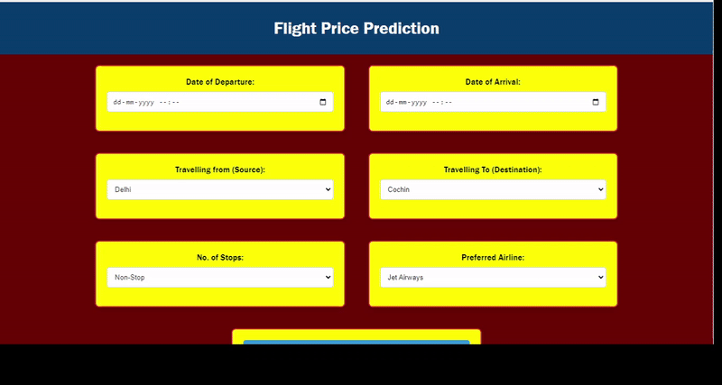

# Flight Fare Forecast Hub
Explore various scenarios, choose your preferred airline, and discover the forecasted fares from a multitude of models. Experience the future of flight pricing at your fingertips.Chatgpt ; )
Go through the project ,one will find  different Regressions and feature selection methods

## Models Included

1.	AdaBoostRegressor
2.	ExtraTreesRegressor
3.	DecisionTreeRegressor
4.	GradientBoostingRegressor
5.	LinearRegressor
6.	RandomForestRegressor
7.	SupportVectorMachineRegressor
8.	XGBRegressor


## Feature Selection Methods
1. Correlation Analysis
2. Low Variance Feature Removal
3. Multicollinearity Check
4. Feature Importance using ExtraTreesRegressor
5. Variance Inflation Factor (VIF)
6. p-value Analysis


## How to Run Locally

To run this project locally, follow these steps:

1. **Clone the Repository:**
   ```bash
   git clone https://github.com/abhilaaash/Flight-Fare-Forecast-Hub.git

2. **Run Each Model to Generate .pkl Files:**
Run each model script to generate the corresponding .pkl files. Place all the generated .pkl files in the root folder of the cloned repository.

3. **Set Up Virtual Environment:**
    ```bash
    pip install virtualenv              # This command installs the virtualenv package, a tool for creating isolated Python environments.      
    virtualenv ENV                      # This command creates a new virtual environment named "ENV" in your current directory.
    .\ENV\Scripts\activate              # This command activates the virtual environment named "ENV".

4. **Install Project Dependencies:**
    ```bash
    pip install -r .\requirements.txt   # Install project dependencies

5. **Run the Project:**
    ```bash
    python app.py


## Contributing

Thank you for considering contributing to the Flight Fare Forecast Hub! Your help is greatly appreciated.
### Connect with Me

[](https://www.linkedin.com/in/your-linkedin-profile/)
[](https://twitter.com/your-twitter-handle)

## UI Previews





### How Can You Contribute?

1. **Reporting Bugs**: If you encounter any bugs or unexpected behavior, please [open an issue](https://github.com/abhilaaash/Flight-Fare-Forecast-Hub.git/issues) and provide detailed information about the problem.

2. **Suggesting Enhancements**: Have an idea to improve the project? [Create an issue](https://github.com/abhilaaash/Flight-Fare-Forecast-Hub.git/issues) and let us know about it.

3. **Code Contributions**: If you want to contribute to the codebase, follow these steps:
   - Fork the repository.
   - Create a new branch for your feature or bug fix.
   - Make changes and test thoroughly.
   - Submit a pull request with a clear description of your changes.

4. **Questions and Discussions**: If you have questions or want to discuss something related to the project, feel free to [start a discussion](https://github.com/abhilaaash/Flight-Fare-Forecast-Hub.git/discussions).

### Getting Started

1. Clone the repository: `git clone https://github.com/abhilaaash/Flight-Fare-Forecast-Hub.git`
2. Install dependencies .
3. Follow the project setup instructions provided in the README.

### Code of Conduct

Please note that this project follows the [Contributor Covenant Code of Conduct](CODE_OF_CONDUCT.md). By participating, you are expected to uphold this code.

### License

This project is licensed under the [MIT License](LICENSE). By contributing, you agree that your contributions will be licensed under this license.

Let's make this project better together!
